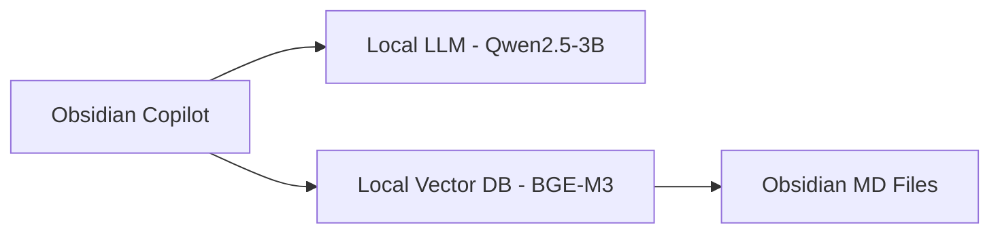

![[p21_obsidian_notebooklm.png]]

## 1. 系統概述 (System Overview)

**目標**：在 Obsidian 中實現類似 NotebookLM 的功能，但完全運行在本地筆記庫上。

**核心組件**：
- **Obsidian Copilot Plugin**：提供 AI 對話界面。
- **oMLX (Apple Silicon 優化)**：運行 Qwen2.5-3B 本地 LLM。
- **BGE-M3 Embedding**：用於本地向量化與語意搜尋。

---

## 2. 架構設計 (Architectural Design)



---

## 3. 數據設計 (Data Design)

- **Vector Storage**：由 Copilot 內建的索引機制管理，使用本地 BGE-M3 將筆記轉換為向量。
- **Context Optimization**：透過篩選特定的資料夾（例如 `Project` 或 `Journal`），提高檢索準確度。

---

## 4. 接口與協議 (Interface Control)

- **LLM API**：OpenAI 兼容格式（由 oMLX 暴露）。
- **Embedding API**：由本地 Python 服務封裝（詳見 P19）。

---

## 5. 詳細設計 (Detailed Design)

### Step 1：啟動本地 LLM (oMLX)

```bash
omlx serve qwen2.5-3b-instruct-q4
```

### Step 2：配置 Copilot Plugin

在 Obsidian Copilot 設定中：
- **Model**：`custom`
- **Base URL**：`http://localhost:8080/v1`
- **Embedding Model**：選擇 `Local BGE-M3` (需確保 P19 的背景服務已啟動)

### Step 3：建立索引

在 Copilot 面板點擊 **"Index Vault"**。索引完成後，即可使用 "Vault QA" 模式進行提問。

---

## 6. 相關連結

- Obsidian Copilot Repo：`https://github.com/logancyang/obsidian-copilot`
- oMLX Repo：`https://github.com/apple/ml-explore`
