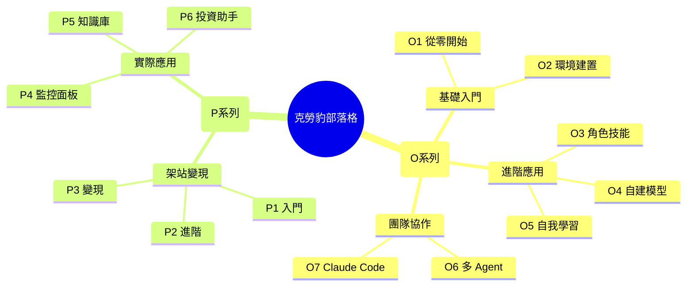

> [!info] 歡迎
> 這裡記錄我學習 AI 和 OpenClaw 的完整旅程。從環境建置到實際應用，每一步都詳細記錄。

---

# 🐆 克勞豹 OpenClaw 部落格

歡迎來到我的 AI 學習筆記！這裡記錄了我如何從零開始學習 OpenClaw，並用它來架網站、自動化任務、管理知識。

---

## 🎯 開始閱讀

### 全新手冊？從這裡開始
[[O1 - 從零開始學 OpenClaw]]

> [!tip] 建議學習路徑
> OpenClaw 新手 → O1 → O2 → O3 → O4
> 有興趣實作 → P1 → P2 → P3

---

## 📚 文章分類

### 📖 OpenClaw 教學系列

| 篇數 | 標題 | 說明 |
|:----:|------|------|
| [[O1]] | 從零開始學 | 基礎概念與心態 |
| [[O2]] | 環境建置 | 安裝與設定 |
| [[O3]] | 角色與技能 | 打造個人化 Agent |
| [[O4]] | 自建 AI 模型 | 省錢秘笈 |
| [[O5]] | 自我學習 | 讓 AI 越來越聰明 |
| [[O6]] | 多 Agent 協作 | 團隊分工 |
| [[O7]] | Claude Code 接入 | 強強聯手 |

---

### 💼 案例專案系列

#### 架站實作
| 篇數 | 標題 |
|:----:|------|
| [[P1]] | 入門 - Obsidian + Quartz |
| [[P2]] | 進階 - Vercel + 網域 |
| [[P3]] | 流量變現 |

#### 應用實例
| 篇數 | 標題 |
|:----:|------|
| [[P4]] | Agent Monitor Board |
| [[P5]] | NotebookLM 知識庫 |
| [[P6]] | 專業操盤手 |

---

## 🧭 網站地圖

---

## 🔗 快速連結

- **GitHub**: [clawdbot520](https://github.com/clawdbot520)
- **網站**: [www.clawdbot520.fyi](https://www.clawdbot520.fyi)
- **聯繫**: [Email](mailto:clawdbot520@gmail.com)

---

> [!note] 持續更新
> 這個部落格會持續更新，有新內容會優先發布在這裡。
