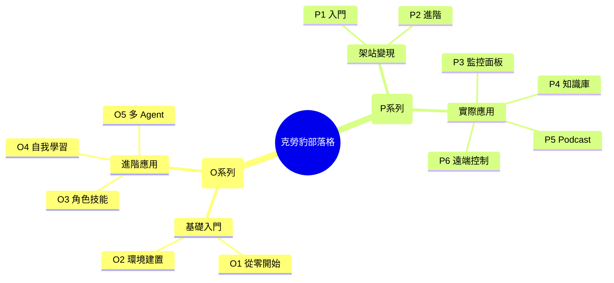

> [!info] 歡迎
> 這裡記錄我學習 AI 和 OpenClaw 的完整旅程。從環境建置到實際應用，每一步都詳細記錄。

---

# 🦭 克勞豹 OpenClaw 部落格

歡迎來到我的 AI 學習筆記！這裡記錄了我如何從零開始學習 OpenClaw，並用它來架網站、自動化任務、管理知識。

---

## 📚 文章分類

### 📖 OpenClaw 教學系列

| 篇數                                    | 標題         | 說明          |
| :------------------------------------ | ---------- | ----------- |
| [[O1 - OpenClaw從０開始]]                 | 從零開始       | 基礎概念與心態     |
| [[O2 - 為什麼是OpenClaw? 怎麼建立的環境]]        | 環境建置       | 安裝與設定       |
| [[O3 - 怎麼幫你的OpenClaw建立專業化的角色和技能]]     | 角色與技能      | 打造個人化 Agent |
| [[O4- Openclaw 如何從錯誤中自我學習，越用越聰明]]     | 自我學習       | 讓 AI 越來越聰明  |
| [[O5 - 一個OpenClaw不夠用，角色切來切去失憶，怎麼解決？]] | 多 Agent 協作 | 團隊分工        |

---

### 💼 案例專案系列

| 篇數                                                           | 標題                     |
| ------------------------------------------------------------ | ---------------------- |
| [[P1 - 利用OpenCLaw架設網頁(入門)- 從0到1到自動化發布]]                      | 入門 - Obsidian + Quartz |
| [[P2 - 利用OpenClaw架設網頁(進階) - 用自己的網域建立變現的基礎設施]]                | 進階 - Vercel + 網域       |
| [[P3 - 想知道OpenClaw在背著你八卦什麼? Agent Monitor Board 告訴你]]        | Agent Monitor Board    |
| [[P4 - 覺得OpenClaw亂回答或是在幻想?  NotebookLM 自建資料庫，給你放心的答案．]]      | NotebookLM 知識庫         |
| [[P5 - 沒時間刷Podcast? 用一句話讓OpenClaw 幫你生成筆記]]                   | Podcast 轉文字            |
| [[P6 - Claude-Code沒有買Max plan又想remote control? 讓OpenClaw幫你]] | Claude Code 遠端控制       |
| [[P8 - 怎麼打通Openclaw 和 ClaudeCode 的雙向記憶共享]] | 雙向記憶共享           |
| [[P9 - 專業操盤手，幫你選股和技術分析]] | AI 投資助手           |

---

## 🧭 網站地圖

---

## 🔗 快速連結

| 連結 | 網址 |
|------|------|
| GitHub | [clawdbot520](https://github.com/clawdbot520) |
| 網站 | [www.clawdbot520.fyi](https://www.clawdbot520.fyi) |
| Email | [clawdbot520@gmail.com](mailto:clawdbot520@gmail.com) |

---

> [!note] 持續更新
> 這個部落格會持續更新，有新內容會優先發布在這裡。
